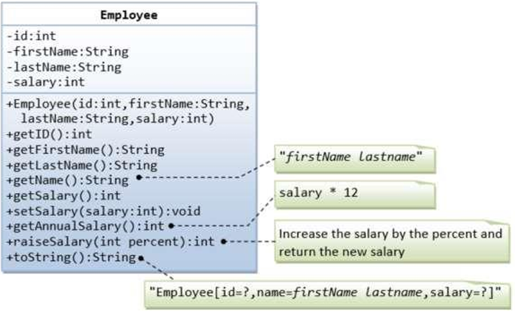
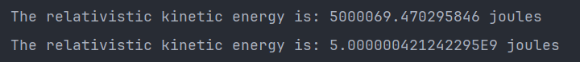
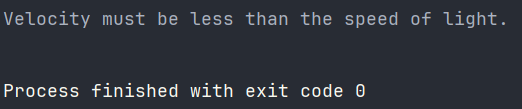

Nama    : Satyavira Prathama
<br>NIM     : 221401126
**<br><br>Soal 1: <br><br>**
Buatlah sebuah program java yang dapat menerima masukan dari user. Tema program bebas disesuaikan dengan selera. Di dalam program tersebut harus ada:
<br>a. Class  
b. Object  
c. Constructor  
d. Method Overloading  
e. Method Overriding
<br>f. Method setter dan getter  
Buatlah penjelasan naratif dalam bentuk  komentar untuk menjelaskan cara kerja program lengkap dengan menyinggung hal-hal diatas seperti alasan menggunakannya dan perannya dalam program.
**<br><br>Soal 2: <br><br>**
Buatlah Program String manipulation dengan Ketentuan:
<br>b. Anagram Checker(NIM Genap). <br>
Anagram adalah kata atau frasa yang terbentuk dari penyusunan ulang huruf huruf dari kata atau frasa lain dengan menggunakan semua huruf yang ada dalam kata atau frasa aslinya dengan jumlah yang sama.
<br>Info tambahan :  - -
<br>Input : String, String
<br>Output : Boolean

**Output:**

**<br><br>Soal 3: <br><br>**
Ada sebuah kelas Employee yang memodelkan karyawan dengan ID, firstName, lastName, dan salary seperti yang ditunjukkan pada class diagram berikut. Method raiseSalary(percent) berfungsi untuk menaikkan gaji dengan persentase tertentu. Tuliskanlah kodingan program untuk class Employee tersebut.  

Berikut kodingan Main program untuk ujicoba class Account
`````
public class TestMain {    public static void
main(String[] args) {  
// Test constructor and toString()  
Employee e1 = new Employee(8, "Xavier", "Valave", 2500);  
System.out.println(e1);  // toString();   
// Test Setters and Getters       e1.setSalary(999);  
System.out.println(e1);  // toString();  
System.out.println("id is: " + e1.getID());  
System.out.println("firstname is: " + e1.getFirstName());  
System.out.println("lastname is: " + e1.getLastName());  
System.out.println("salary is: " + e1.getSalary());   
System.out.println("name is: " + e1.getName());  
System.out.println("annual salary is: " + e1.getAnnualSalary()); //Test method

      // Test raiseSalary()  
      System.out.println(e1.raiseSalary(10));  
      System.out.println(e1);  
}  
} 
`````

Expected output
`````
Employee[id=8,name=Xavier Valave,salary=2500] Employee[id=8,name=Xavier
Valave,salary=999] id is: 8 firstname is: Xavier lastname is: Valave salary is: 999
name is: Xavier Valave annual salary is: 11988  
1098  
Employee[id=8,name=Xavier Valave,salary=1098]  
`````
**Output:**

**<br><br>Soal 4: <br><br>**
Buatlah Sebuah Program Menggunakan Overloading Dan Constructor Untuk Menghitung Rumus Complex(Semakin kompleks, semakin baik) dari Mata Pelajaran Fisika atau Matematika, setiap orang boleh memilih secara bebas rumus apa yang ingin dioperasikan dalam program.

**Output:**
<br><br>Output 1:

<br><br>Output 2:

