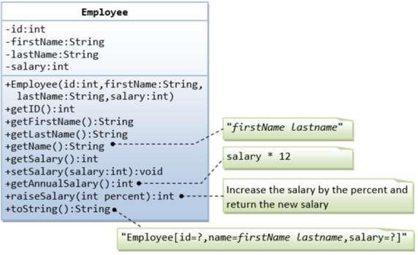
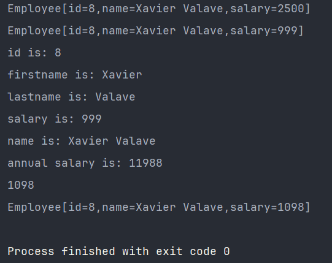

Ada sebuah kelas Employee yang memodelkan karyawan dengan ID, firstName, lastName, dan salary seperti yang ditunjukkan pada class diagram berikut. Method raiseSalary(percent) berfungsi untuk menaikkan gaji dengan persentase tertentu. Tuliskanlah kodingan program untuk class Employee tersebut.  

Berikut kodingan Main program untuk ujicoba class Account
`````
public class TestMain {    public static void
main(String[] args) {  
// Test constructor and toString()  
Employee e1 = new Employee(8, "Xavier", "Valave", 2500);  
System.out.println(e1);  // toString();   
// Test Setters and Getters       e1.setSalary(999);  
System.out.println(e1);  // toString();  
System.out.println("id is: " + e1.getID());  
System.out.println("firstname is: " + e1.getFirstName());  
System.out.println("lastname is: " + e1.getLastName());  
System.out.println("salary is: " + e1.getSalary());   
System.out.println("name is: " + e1.getName());  
System.out.println("annual salary is: " + e1.getAnnualSalary()); //Test method

      // Test raiseSalary()  
      System.out.println(e1.raiseSalary(10));  
      System.out.println(e1);  
}  
} 
`````

Expected output   
`````
Employee[id=8,name=Xavier Valave,salary=2500] Employee[id=8,name=Xavier
Valave,salary=999] id is: 8 firstname is: Xavier lastname is: Valave salary is: 999
name is: Xavier Valave annual salary is: 11988  
1098  
Employee[id=8,name=Xavier Valave,salary=1098]  
`````
**Output:**
