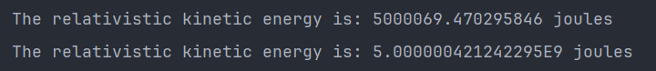
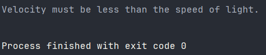

Buatlah Sebuah Program Menggunakan Overloading Dan Constructor Untuk Menghitung Rumus Complex(Semakin kompleks, semakin baik) dari Mata Pelajaran Fisika atau Matematika, setiap orang boleh memilih secara bebas rumus apa yang ingin dioperasikan dalam program.  

**Output:**
  Output 1:

  Output 2:

